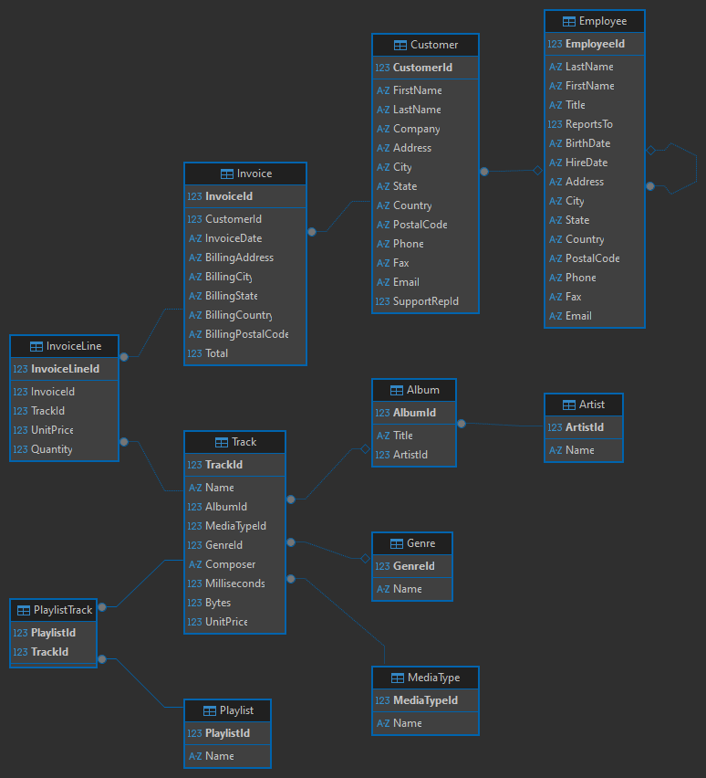

# Media Manager Project
You and your team have been tasked with building a media management application for RevaStudio. The company has won a contract to rebuild the Chinook Media Company's web platform from the ground up, and this is where you come in. The Chinook Media Company plans on slowly migrating operations to the new platform, and they want to start with implementing core platform features.
## Application Features

### Client-Side MVP
Implement Angular for the following:
- Login/Logout feature for customers and employees
- Customers
    - dashboard to see tracks owned
        - album & artist data should also be available for tracks
        - only tracks purchased by the customer should be available to view at this time
    - feature to send a support ticket to the customer's assigned support employee and see responses
- Employees
    - dashboard to see sales metrics
        - what customers they have assisted with sales
        - what tracks were purchased
        - how much the customer was billed
    - feature to see and respond to customer support tickets
        - can close tickets

### Server-Side MVP
Implement Spring Boot to facilitate the Client-Side MVPs
- Should implement a RESTful API
- Authentication should be handled via JWT
- A Service layer should facilitate all business logic
- A Repository layer should facilitate all database interactions

## Persistence
An SQLite database should be used for persistence. Use the pre-provided [SQLite Chinook database](https://github.com/lerocha/chinook-database) and/or the startup script found in the ChinookDatabase/DataSources directory

## Entities
ERD for the database. Note you do not need an entity for every single table, just those necessary for the Client-Server MVPS.
